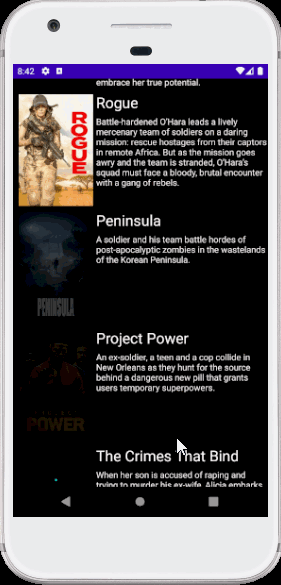
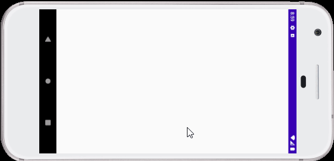
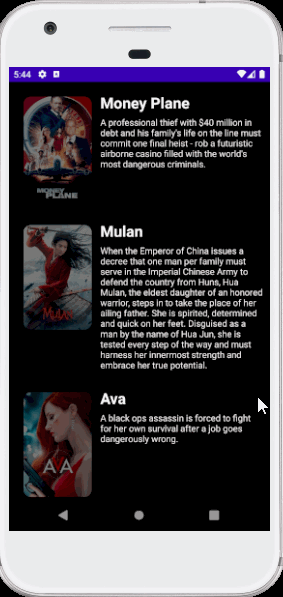

# Flix
Flix is an app that allows users to browse movies from the [The Movie Database API](http://docs.themoviedb.apiary.io/#).

### User Stories

#### Required
- [x] User can view a list of movies (title, poster image, and overview) currently playing in theaters from the Movie Database API.
- [x] Expose details of movie (ratings using RatingBar, popularity, and synopsis) in a separate activity.
- [x] Allow video posts to be played in full-screen using the YouTubePlayerView.

#### Optional
- [x] Views should be responsive for both landscape/portrait mode.
   - [x] In portrait mode, the poster image, title, and movie overview is shown.
   - [x] In landscape mode, the rotated alternate layout should use the backdrop image instead and show the title and movie overview to the right of it.
- [x] Display a nice default [placeholder graphic](https://guides.codepath.org/android/Displaying-Images-with-the-Glide-Library#advanced-usage) for each image during loading
- [x] Improved the user interface by experimenting with styling and coloring.
- [ ] For popular movies (i.e. a movie voted for more than 5 stars), the full backdrop image is displayed. Otherwise, a poster image, the movie title, and overview is listed. Use Heterogenous RecyclerViews and use different ViewHolder layout files for popular movies and less popular ones.
- [x] Implement a shared element transition when user clicks into the details of a movie (1 point).
- [x] Trailers for popular movies are played automatically when the movie is selected (1 point).
  - [x] When clicking on a popular movie (i.e. a movie voted for more than 5 stars) the video should be played immediately.
  - [x] Less popular videos rely on the detailed page should show an image preview that can initiate playing a YouTube video.
- [ ] Add a play icon overlay to popular movies to indicate that the movie can be played (1 point).
- [x] Apply the popular ButterKnife annotation library to reduce view boilerplate. (1 point)
- [x] Add a rounded corners for the images using the Glide transformations. (1 point)

### App Walkthough GIF

Portrait:

 

Landscape:

 

 

### Notes

Describe any challenges encountered while building the app.

## Open-source libraries used
- [Android Async HTTP](https://github.com/codepath/CPAsyncHttpClient) - Simple asynchronous HTTP requests with JSON parsing
- [Glide](https://github.com/bumptech/glide) - Image loading and caching library for Android
